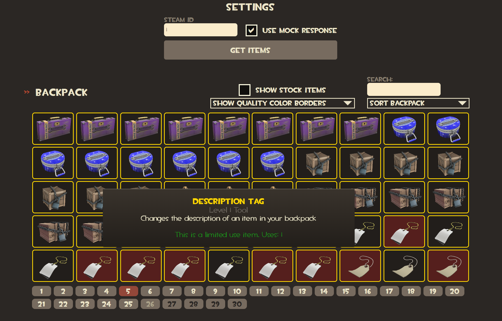

# BackpackViewer

A simple app for viewing TF2 inventories.

Built with React and .NET.

## Screenshot

## Getting Started

### Run the API

1. `cd src/api`
2. `dotnet build`
3. `dotnet run --project ./BackpackViewer.API/BackpackViewer.API.csproj`

### Run the frontend

1. `cd src/frontend`
2. `npm i`
3. `npm run dev`

The web app should now be accessible at `http://localhost:5173/`.

## Getting Started (Docker)

1. `cd src`
2. `docker compose up`

The web app should now be accessible at `http://localhost:5173/`.
